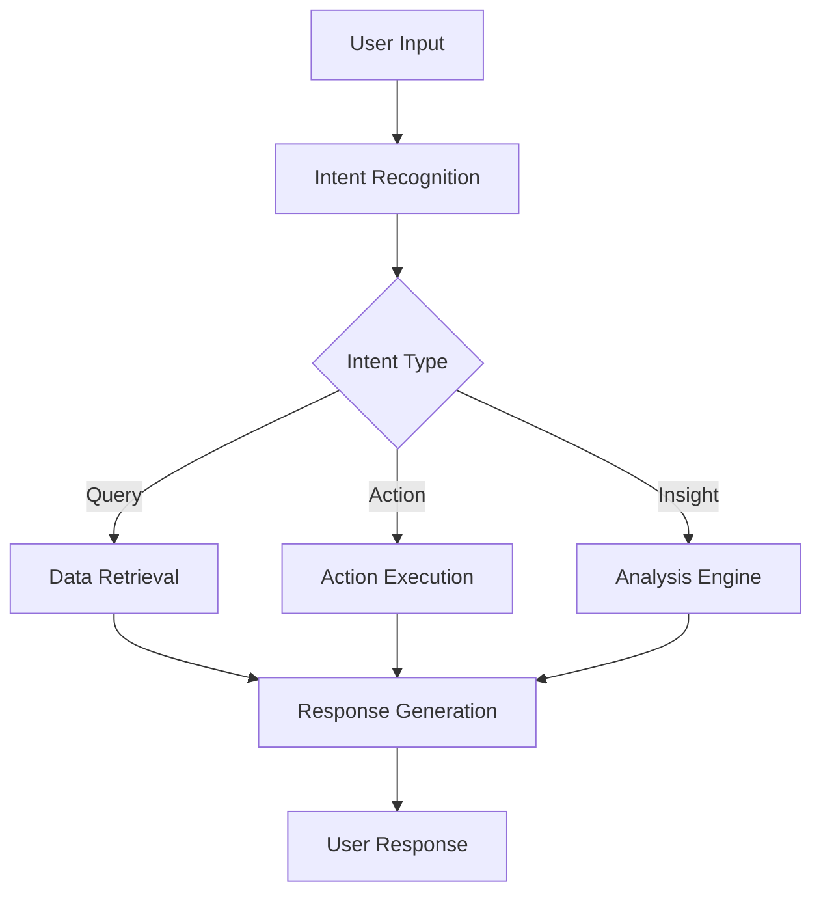

# AI Conversational UI

## Overview

Bajeti v2 incorporates an AI-powered conversational interface to help users manage their finances through natural language interactions. This document outlines the design principles, user flows, and implementation details for this feature.

## Design Principles

### 1. Natural Interaction
- Conversational UI should feel like talking to a knowledgeable financial assistant
- Support for natural language queries without requiring specific syntax
- Contextual awareness to maintain conversation flow

### 2. Accessibility
- Voice input and output for hands-free operation
- Text-based interaction for quiet environments
- Simple, jargon-free language with explanations when needed

### 3. Proactive Assistance
- Offer insights without being prompted
- Suggest actions based on user's financial patterns
- Provide timely reminders for budget goals and bill payments

### 4. Progressive Disclosure
- Start with simple interactions and gradually introduce advanced features
- Adapt complexity based on user's demonstrated financial literacy
- Provide "learn more" options for deeper explanations

### 5. Transparency
- Clearly indicate when AI is making recommendations vs. stating facts
- Explain reasoning behind financial insights
- Allow users to see data sources for recommendations

## Conversation Flows

### 1. Budget Inquiries

**Example Flow:**
```
User: "How much have I spent on groceries this month?"

AI: "You've spent $342 on groceries this month, which is 85% of your $400 grocery budget. You have $58 left for the next 9 days."

User: "How does that compare to last month?"

AI: "Last month, you spent $385 on groceries, so you're currently spending about 11% less. Would you like to see a chart comparing your grocery spending over the past few months?"

User: "Yes, please."

[AI displays grocery spending chart]

AI: "I notice you typically spend more on groceries in the last week of the month. Would you like me to set aside the remaining $58 specifically for that period?"
```

### 2. Financial Insights

**Example Flow:**
```
User: "What's my biggest expense category?"

AI: "Your biggest expense category this month is 'Dining Out' at $520, which is 24% of your total spending. This is also $120 over your monthly dining budget of $400."

User: "That's too much. Any suggestions to reduce it?"

AI: "Based on your transaction history, you eat out most frequently on weekdays during lunch. You could save approximately $200 monthly by bringing lunch from home 3 days a week. Would you like me to help you set a more specific goal for reducing dining expenses?"

User: "Yes, let's aim to cut it by $100 next month."

AI: "Great! I've created a new goal to reduce dining expenses to $420 next month. I'll send you a notification when you're approaching 75% of this budget. Would you also like weekly updates on your progress?"
```

### 3. Goal Setting and Tracking

**Example Flow:**
```
User: "I want to save for a vacation."

AI: "I'd be happy to help you save for a vacation. Could you tell me your target amount and when you'd like to take this vacation?"

User: "I need $2,000 by July next year."

AI: "To save $2,000 by July 2026, you'll need to set aside about $133 per month. Based on your current spending patterns, I can see a few options to help you reach this goal:

1. Reduce your entertainment budget by $50/month
2. Set up an automatic transfer of $133 to a dedicated vacation savings account
3. Use the $200 monthly surplus from your income after other expenses

Which approach would you prefer, or would you like to see other options?"
```

## Technical Implementation

### 1. NLP Processing Pipeline



### 2. Intent Recognition

The system will identify the following core intents:

- **Informational Queries**: Questions about current financial state
- **Comparative Queries**: Questions comparing current to historical data
- **Action Requests**: Requests to perform actions (create budget, log expense)
- **Goal Setting**: Expressions of financial goals
- **Help Requests**: Questions about how to use the system
- **Feedback**: Expressions of satisfaction or dissatisfaction

### 3. Context Management

- Maintain conversation history for contextual understanding
- Track entity references across multiple turns
- Store user preferences for personalized responses

### 4. Response Generation

- Template-based responses for common queries
- Dynamic content insertion based on user data
- Natural language generation for complex insights
- Multi-modal responses (text, charts, actionable buttons)

### 5. AI Model Selection

- Base model: OpenAI GPT-4 or equivalent
- Fine-tuned on financial conversations and domain-specific terminology
- Supplemented with retrieval-augmented generation for accurate financial data

## User Experience Considerations

### 1. Onboarding

- Introduce conversational capabilities gradually
- Provide example queries to help users get started
- Offer guided tutorials for first-time users

### 2. Conversation UI Elements

- Persistent chat button in bottom corner of app
- Expandable chat interface with message history
- Voice input button with visual feedback
- Suggested follow-up queries
- Rich message formatting for financial data

### 3. Error Handling

- Graceful responses to misunderstood queries
- Clarification requests when intent is ambiguous
- Fallback to search or navigation options when appropriate
- User feedback collection for misunderstood queries

### 4. Privacy Controls

- Clear indication when conversation begins/ends
- Options to delete conversation history
- Transparency about data usage
- Opt-out options for specific AI features

## Implementation Roadmap

### Phase 1: Basic Query Handling
- Implement core financial queries (balances, spending, budgets)
- Build basic NLP pipeline with intent recognition
- Develop template-based response system

### Phase 2: Enhanced Understanding
- Add support for follow-up questions and context
- Implement comparative analysis capabilities
- Develop visualization responses for data queries

### Phase 3: Proactive Insights
- Build anomaly detection for spending patterns
- Implement predictive budget forecasting
- Develop personalized financial recommendations

### Phase 4: Voice Interface
- Add speech-to-text and text-to-speech capabilities
- Optimize for voice-specific interaction patterns
- Implement ambient mode for hands-free operation

## Success Metrics

- **Engagement**: Percentage of users utilizing conversational features
- **Comprehension**: Rate of successfully understood queries
- **Task Completion**: Percentage of user intents fulfilled
- **Efficiency**: Time saved compared to traditional UI navigation
- **Satisfaction**: User ratings and feedback on AI interactions
